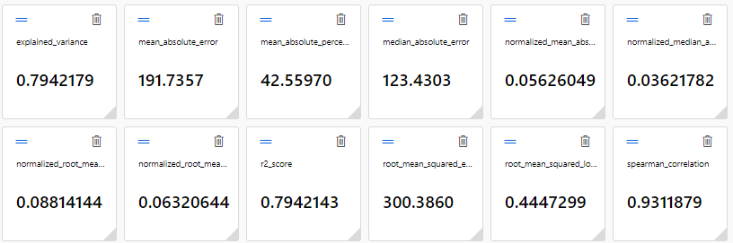
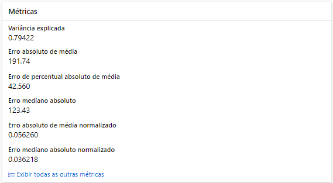
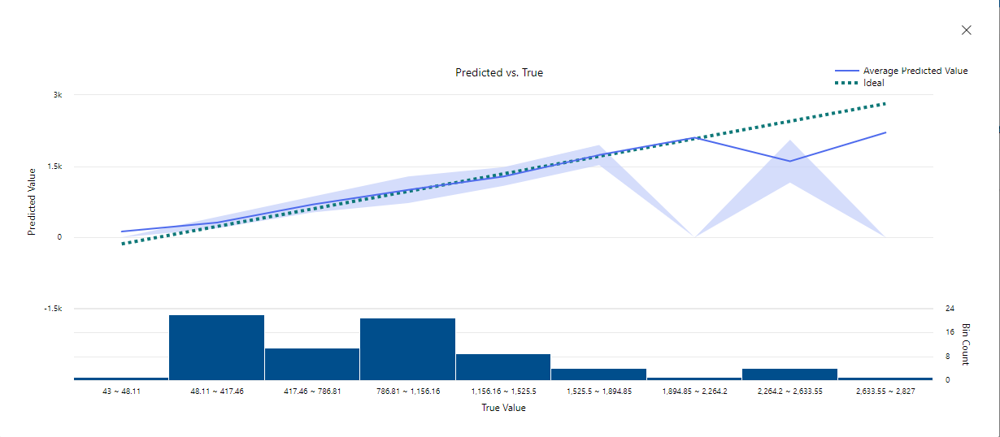
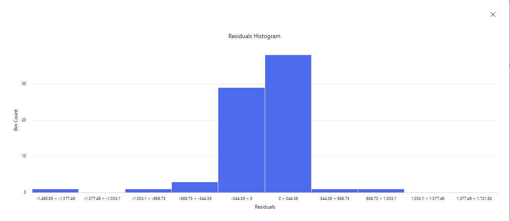

<div style="border: 0px solid #00f; padding: 10px; display: flex; justify-content: center;">
    <div style="box-shadow: 3px 3px 5px #888; display: flex; align-items: center; text-align: center; font-family: 'Verdana', sans-serif;">        
        <h1 style="margin: 0; text-shadow: 2px 2px 3px #888;">Microsoft Azure AI Fundamentals</h1>
    </div>
</div>

<br>
<div style="border: 0px solid #00f; padding: 10px; display: flex; align-items: center; justify-content: center; text-align: center; font-family: 'Lato', sans-serif;">
    <h2 style="margin: 0; text-shadow: 2px 2px 3px #888; font-family: 'Helvetica', sans-serif; text-decoration: none;">Trabalhando com Machine Learning na Prática no Azure ML</h2>
</div>


<div style="border: 0px solid #00f; padding: 10px; display: flex; align-items: center; justify-content: center; text-align: center;">
    <div style="display: flex; align-items: center; justify-content: center;">
               <h4 style="margin: 0; text-shadow: 2px 2px 3px #888; font-family: 'Raleway', sans-serif;">I ❤️ Front-End Development!</h4>
    </div>
</div>


<h3>Encontre-me :handshake: </h3> 


<p align="center">
    <a href="https://www.linkedin.com/in/renatomoreira-rm/" target="_blank">
        
    </a>
    <a href="https://github.com/RenatoMor" target="_blank">
        
    </a>
    <a href="https://discord.com/channels/@me/1123380010779152444/" target="_blank">
        
    </a>
</a>
    <a href="https://kovihq.slack.com/" target="_blank">
        
    </a>
    <a href="https://www.instagram.com/renatomorspider/" target="_blank">
        
    </a>
    <a href="mailto:piano.tato@gmail.com" target="_blank">
        
    </a>
</p>
</p>
<br>

---

### Menu

- [Descrição :scroll:](#descrição-scroll)
- [Introdução :pushpin:](#introdução-pushpin)
- [Workspace do Azure ML :dart:](#workspace-do-azure-ml-dart)
- [Aprendizado de máquina :computer:](#aprendizado-de-máquina-computer)
- [Treinando um Modelo :hammer\_and\_wrench:](#treinando-um-modelo-hammer_and_wrench)
- [Avalie o melhor modelo :cyclone:](#avalie-o-melhor-modelo-cyclone)
- [Implantando e testando o modelo :sparkles:](#implantando-e-testando-o-modelo-sparkles)
- [Licença :traffic\_light:](#licença-traffic_light)
- [Agradecimentos :tada:](#agradecimentos-tada)

## Descrição :scroll:

**Explorando o Machine Learning Automatizado no Azure Machine Learning**

Bem-vindo ao desafio de Machine Learning Automatizado no Azure Machine Learning! Neste guia, você terá a oportunidade de mergulhar no emocionante mundo do aprendizado de máquina, utilizando os recursos automatizados oferecidos pelo Azure Machine Learning.

## Introdução :pushpin:

O Machine Learning Automatizado simplifica o processo de treinamento e avaliação de modelos, permitindo que você experimente diversos algoritmos e parâmetros de maneira eficiente. No decorrer deste desafio eu utilizei um conjunto de dados de detalhes históricos de aluguel de bicicletas para prever o número de aluguéis esperados em um determinado dia, com base em características sazonais e meteorológicas.

## Workspace do Azure ML :dart:

Para começar, é necessário configurar seu espaço de trabalho no Azure Machine Learning. Siga os passos abaixo:

1. Faça login no [Portal Azure](https://portal.azure.com) usando suas credenciais. Se você ainda não possui uma conta, será necessário criar uma para prosseguir.
Para iniciar, acesse o portal do Azure através do link [https://portal.azure.com](https://portal.azure.com) utilizando suas credenciais da Microsoft.

2. Em seguida, clique em "+ Criar um recurso", pesquise por "Machine Learning" e crie um novo recurso do Azure Machine Learning, fornecendo as seguintes configurações:

- **Assinatura:** Sua assinatura do Azure.
- **Grupo de recursos:** Crie um novo grupo de recursos ou selecione um existente.
- **Nome:** Insira um nome exclusivo para o seu espaço de trabalho.
- **Região:** Selecione a região geográfica mais próxima.
- **Conta de armazenamento:** Observe a nova conta de armazenamento padrão criada para o seu espaço de trabalho.
- **Key:** Observe a nova key padrão criado para o seu espaço de trabalho.
- **Insights de aplicativo:** Observe o novo recurso padrão de insights de aplicativo criado para o seu espaço de trabalho.
- **Registro de contêiner:** Nenhum (será criado automaticamente na primeira vez que você implantar um modelo em um contêiner).

3. Após configurar as opções, selecione "Revisar + criar" e, em seguida, clique em "Criar". Aguarde a criação do seu espaço de trabalho, o que pode levar alguns minutos. Em seguida, acesse o recurso implantado.

4. Para continuar, selecione "Launch Studio" no Azure Machine Learning Studio ou abra uma nova guia do navegador e vá para [https://ml.azure.com](https://ml.azure.com), fazendo login no Azure Machine Learning Studio com sua conta da Microsoft. Certifique-se de fechar todas as mensagens exibidas.

5. No estúdio Azure Machine Learning, você deverá visualizar seu espaço de trabalho recém-criado. Se isso não acontecer, vá para o menu à esquerda, selecione "Todos os espaços de trabalho" e escolha o espaço de trabalho recém-criado.

...

## Aprendizado de máquina :computer:    

O aprendizado de máquina automatizado permite experimentar com vários algoritmos e parâmetros. Nesse desafio foram usados um conjunto de dados de detalhes históricos de aluguel de bicicletas.

## Treinando um Modelo :hammer_and_wrench:

Agora, vamos usar a mágica do aprendizado de máquina automatizado para criar um modelo preditivo divertido! 🚴‍♂️

1. No Azure Machine Learning Studio, vá até a página "Automated ML" (em Authoring).

2. Crie um novo trabalho de Machine Learning automatizado com as configurações abaixo (você pode clicar em "Next" para avançar na interface):

   - **Configurações Básicas:**
     - Nome do trabalho: mslearn-bike-automl
     - Novo nome do experimento: mslearn-bike-rental
     - Descrição: Aprendizado de máquina automatizado para previsão de aluguel de bicicletas
     - Marcadores: nenhum

   - **Tipo de Tarefa e Dados:**
     - Selecione o tipo de tarefa: Regressão
     - Crie um novo conjunto de dados chamado "aluguel de bicicletas" com dados históricos de aluguel de bicicletas.
     - Fonte de dados: Dos arquivos da web com a URL [https://aka.ms/bike-rentals](https://aka.ms/bike-rentals)

   - **Configurações do Conjunto de Dados:**
     - Formato de arquivo: Delimitado
     - Delimitador: Vírgula
     - Cabeçalhos de coluna: Apenas o primeiro arquivo possui cabeçalhos
     - ...

   - **Configurações de Tarefa:**
     - Tipo de tarefa: Regressão
     - Coluna de destino: Aluguéis (inteiro)
     - ...

   - **Configurações Adicionais:**
     - Métrica primária: Raiz do erro quadrático médio normalizado
     - Usar apenas **RandomForest** e **LightGBM** como modelos.
     - Limites: Máximo de testes, tempo limite, etc.

3. Envie o trabalho de treinamento. Fique tranquilo, ele começará automaticamente.

4. Aguarde até que o trabalho termine. Pode demorar um pouquinho, então talvez seja hora de um café!

Divirta-se explorando o mundo do Machine Learning automatizado! 🚀

...

## Avalie o melhor modelo :cyclone:

Após a mágica do aprendizado de máquina automático, é hora de dar uma espiadinha no melhor modelo que ele achou.

1. Vá para a guia "Visão Geral" no Azure Machine Learning Studio. Dá uma olhada no resumo do modelo - é tipo o cartão de visita dele.



2. Ah, relaxa se aparecer uma mensagem dizendo "Aviso: pontuação de saída especificada pelo usuário alcançada...". Isso é normal, ok?

3. Dá um clique no nome do algoritmo do melhor modelo para ver mais detalhes.

4. Depois, vai para a guia "Métricas" e escolhe os gráficos de resíduos e predito_true, se ainda não tiverem sido escolhidos.

5. Agora, dá uma boa olhada nos gráficos que mostram como o modelo está se saindo. O gráfico de resíduos é tipo um histograma das diferenças entre o que o modelo previu e o que realmente aconteceu. Já o gráfico predito_true compara os valores previstos com os valores verdadeiros.

Vamos explorar o desempenho desse modelo incrível!

## Implantando e testando o modelo :sparkles:

Agora, vamos colocar o modelo para trabalhar! 🚀

1. Vá até a guia "Modelo" do melhor modelo treinado pelo aprendizado de máquina automático.

2. Selecione "Implantar" e use a opção de serviço Web para soltar o modelo no mundo com as seguintes configurações:

   - **Nome:** prever-aluguéis
   - **Descrição:** Prever aluguel de bicicletas
   - **Tipo de Computação:** Instância de Contêiner do Azure
   - **Habilitar Autenticação:** Selecionado

3. Espere só um pouquinho para a mágica acontecer. O status de implantação do endpoint de previsão de aluguel vai de "Running" para "Succeeded" em alguns segundos, mas pode levar de 5 a 10 minutos.

Pronto! Agora o modelo está pronto para brilhar. Bora testar? 🌟

**Métricas**



---

**Previsto**
   


---

**Residuais**



...
- **Dados de entrada para teste**

 
```json
"TESTE":

{ 
    "Inputs": { 
      "data": [
        {
          "day": 1,
          "mnth": 1,   
          "year": 2022,
          "season": 2,
          "holiday": 0,
          "weekday": 1,
          "workingday": 1,
          "weathersit": 2, 
          "temp": 0.3, 
          "atemp": 0.3,
          "hum": 0.3,
          "windspeed": 0.3 
        }
      ]    
    },   
    "GlobalParameters": 1.0
  }

"RESULTADO"

  {
    "Results": [
      341.0069147012059
    ]
  }
```
---


## Licença :traffic_light:
Este projeto está licenciado sob a Licença consulte o arquivo 
 [MIT](https://opensource.org/licenses/MIT).


## Agradecimentos :tada:

_**Digital Innovation One**_ 

Agradeço à Digital Innovation One por proporcionar recursos educacionais valiosos que contribuíram para o desenvolvimento dos meus projetos.

<a href="https://digitalinnovation.one/" target="_blank">
  
</a>

<br>


_**Azure**_

Expresso minha gratidão à equipe do Microsoft Azure por oferecer uma plataforma robusta e escalável para hospedar e gerenciar aplicativos em nuvem. A eficiência e confiabilidade do Azure são fundamentais para o sucesso de muitos projetos.

[](https://code.visualstudio.com/)

_**VS Code**_

Agradeço à equipe do Visual Studio Code pelo incrível editor que facilita o desenvolvimento deste projeto.

[](https://code.visualstudio.com/)


_**Microsoft**_

Agradeço à equipe da Microsoft por suas contribuições inovadoras para o mundo da tecnologia. Sua dedicação ao desenvolvimento de software e serviços tem impactado positivamente a comunidade global de desenvolvedores.

[](https://www.microsoft.com/pt-br/)

_**GitHub**_ 

Agradeço à equipe do GitHub por fornecer uma plataforma de desenvolvimento colaborativo que facilita o compartilhamento de projetos.

[](https://github.com/RenatoMor)

Copyright © 2024 / RenatoMor


